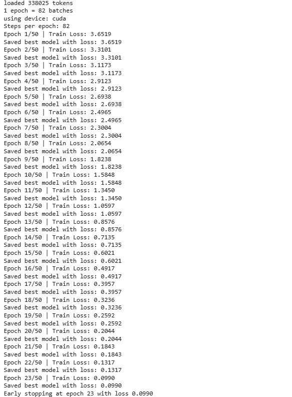

# GPT-2 Text Generator

This is a Streamlit app that generates text using a fine-tuned GPT-2 model.

## Model

The model is hosted at: https://huggingface.co/your-username/gpt2-custom

## Features

- Interactive text generation
- Adjustable parameters:
  - Temperature (0.1-1.0)
  - Maximum length
  - Top-k sampling
- Real-time generation

## How to Use

1. Enter your prompt in the text area
2. Adjust generation parameters in the sidebar
3. Click "Generate Text"
4. Wait for the model to generate text
5. View the generated output

# GPT-2 Training from Scratch

Introduction

This project involves training a GPT-2 model from scratch using a custom dataset. GPT-2 is based on the Transformer architecture, which enables it to generate coherent and contextually relevant text. This README provides an overview of the Transformer architecture, the training process, and the implementation details. 🤖

## What is a Transformer? 🤔

Imagine you're playing with building blocks, but these are special blocks that help the computer understand and write text! Let me explain how it works:

### 1. Reading Words 👀
- Think of it like when you're reading a book
- The computer looks at each word one by one
- Just like you remember what happened at the beginning of a story while reading the end

### 2. Paying Attention 🎯
- Imagine you're in a room full of toys
- Some toys are more important than others right now
- The transformer does the same with words - it pays more attention to important words
- This is called "attention" (like when your parent says "pay attention!")

### 3. Learning Patterns 🧩
- Just like you learn that after "1, 2, 3" comes "4"
- The transformer learns patterns in words
- If it sees "Once upon a..." it might think "time" comes next
- It's like having a super-smart friend who remembers every story they've ever read!

### 4. Making Predictions 🎮
- It's like a guessing game
- After seeing some words, it tries to guess what word might come next
- The more it practices, the better it gets at guessing
- Just like how you get better at a game by playing it more

### 5. Learning from Mistakes ✏️
- When it guesses wrong, it learns from its mistake
- Just like when you're learning to write and fix your spelling
- Each time it makes a mistake, it tries to do better next time

## How Does It Work? 🔨

1. **Input**: Give it some words (like the beginning of a story)
2. **Processing**: It looks at all the words and their relationships
3. **Output**: It writes new words to continue your text

Think of it like a super-smart parrot 🦜 that:
- Remembers everything it's ever read
- Understands how words work together
- Can help you finish your sentences
- Gets better with practice


## Transformer Architecture

The Transformer model, introduced in "Attention is All You Need" (Vaswani et al., 2017), is the foundation of GPT-2. It replaces recurrence with self-attention mechanisms, enabling better parallelization and long-range dependencies.

### **1. Model Components**

The Transformer consists of an encoder-decoder structure, but GPT-2 only utilizes the decoder stack for autoregressive language modeling.

#### **Decoder Layer Architecture:**

- **Token Embedding Layer** - Maps input tokens to dense vectors.
- **Positional Encoding** - Adds positional information to maintain order.
- **Stacked Transformer Blocks**, each containing:
  - **Multi-Head Self-Attention**
  - **Feed-Forward Network (FFN)**
  - **Layer Normalization & Residual Connections**
- **Final Linear & Softmax Layer** - Outputs probability distribution over vocabulary.

### **2. Self-Attention Mechanism**

The core of the Transformer is the self-attention mechanism, which computes attention scores between words in an input sequence.

#### **Self-Attention Calculation:**

For input token embeddings \(X\), self-attention is computed as:

$$
Q = XW_Q, \quad K = XW_K, \quad V = XW_V
$$

where \(W_Q, W_K, W_V\) are learnable weight matrices.

Attention scores are computed using the scaled dot-product:

$$
\text{Attention}(Q, K, V) = \text{softmax}\left(\frac{QK^T}{\sqrt{d_k}}\right) V
$$

where \(d_k\) is the dimension of keys.

#### **Example:**

For three tokens with embeddings:

$$
X = \begin{bmatrix}1 & 0 & 1 \\ 0 & 1 & 1 \\ 1 & 1 & 0 \end{bmatrix}
$$

and random weight matrices \(W_Q, W_K, W_V\), we compute \(Q, K, V\), derive attention scores, apply softmax, and generate weighted values for final representation.

### **3. Multi-Head Attention**

Instead of computing single self-attention, multi-head attention projects inputs into multiple attention spaces:

$$
\text{MultiHead}(Q, K, V) = \text{Concat}(\text{head}_1, \text{head}_2, ..., \text{head}_h)W_O
$$

where each head has separate \(W_Q, W_K, W_V\) and \(W_O\) is an output projection matrix.

### **4. Feed-Forward Network (FFN)**

Each Transformer block contains an FFN applied independently to each position:

$$
FFN(x) = \text{ReLU}(xW_1 + b_1) W_2 + b_2
$$

where \(W_1, W_2\) are learnable weight matrices and \(b_1, b_2\) are biases.

### **5. Masked Self-Attention (for GPT-2)**

GPT-2 uses causal attention to prevent attending to future tokens. The attention mask ensures:

$$
\text{Mask}(i, j) = \begin{cases} -\infty, & j > i \\ 0, & j \leq i \end{cases}
$$

which restricts information flow.

---

## Training Process

### **1. Preprocessing**

- Tokenization using Byte Pair Encoding (BPE).
- Creating input-target pairs for causal modeling.

### **2. Model Training**

- Training from scratch using PyTorch or TensorFlow.
- Using Adam optimizer with weight decay.
- Warm-up and cosine decay for learning rate scheduling.

### Training logs



---

## Usage Guide 🚀

### Project Structure
```
project/
├── src/
│   ├── model.py      # GPT model implementation
│   ├── trainer.py    # Training logic
│   └── lr_finder.py  # Learning rate finder
├── app.py           # Streamlit interface
└── requirements.txt # Dependencies
```

### 1. Installation

```bash
# Clone the repository
git clone <your-repo-url>
cd <repo-name>

# Install dependencies
pip install -r requirements.txt
```

### 2. Training

#### a. Find Optimal Learning Rate
```bash
# Run learning rate finder
python src/lr_finder.py
```
This will:
- Test different learning rates
- Generate a plot showing loss vs learning rate
- Suggest optimal learning rate for training

#### b. Train the Model
```bash
# Start training
python src/trainer.py
```

Training features:
- Automatic checkpointing of best models
- MLflow experiment tracking
- Early stopping when loss < 0.1
- Learning rate scheduling

Monitor training:
```bash
# View MLflow dashboard
mlflow ui
```

### 3. Text Generation

#### a. Using Streamlit Interface
```bash
# Launch the web interface
streamlit run app.py
```
Features:
- Interactive text generation
- Adjustable parameters:
  - Temperature (0.0 - 1.0)
  - Top-k sampling
  - Maximum length

#### b. Using Python API
```python
!python src/generate.py \
    --prompt "To be, or not to be, that is the question" \
    --max_tokens 200 \
    --temperature 0.9 \
    --top_k 50 \
    --model_path "/content/drive/MyDrive/Assignment12/best_model.pth"
```

### 4. Configuration

Key parameters in `config.py`:
```python
config = {
    'n_layer': 12,        # Number of transformer blocks
    'n_head': 12,         # Number of attention heads
    'n_embd': 768,        # Embedding dimension
    'block_size': 1024,   # Maximum sequence length
    'dropout': 0.1        # Dropout rate
}
```

Training parameters in `trainer.py`:
```python
training_params = {
    'batch_size': 16,
    'sequence_length': 256,
    'learning_rate': 1e-4,
    'weight_decay': 0.01,
    'epochs': 50
}
```

### 5. Troubleshooting

Common issues and solutions:

1. **CUDA Out of Memory**
   - Reduce batch size
   - Reduce sequence length
   - Use gradient accumulation

2. **Slow Training**
   - Enable mixed precision training
   - Increase batch size if memory allows
   - Use multiple GPUs if available

3. **Poor Generation Quality**
   - Adjust temperature (lower for focused, higher for creative)
   - Increase top-k value
   - Train for more epochs

### 6. Best Practices

1. **Training**
   - Start with small model for testing
   - Use learning rate finder before training
   - Monitor training metrics with MLflow
   - Save checkpoints regularly

2. **Generation**
   - Start with temperature = 0.8
   - Use top-k = 40 for balanced output
   - Experiment with different prompts

3. **Model Management**
   - Keep best checkpoint separate
   - Log experiments with MLflow
   - Document hyperparameters
---

## Conclusion

Training GPT-2 from scratch is computationally expensive but offers control over architecture and dataset customization. The Transformer's self-attention mechanism enables effective context retention, making GPT-2 a powerful generative model.

For improvements:

- Experiment with different model sizes (small, medium, large GPT-2).
- Optimize hyperparameters for better convergence.
- Explore fine-tuning on domain-specific data.

---

## References

- Vaswani et al., "Attention is All You Need" (2017)
- Radford et al., "Language Models are Unsupervised Multitask Learners" (2019)

