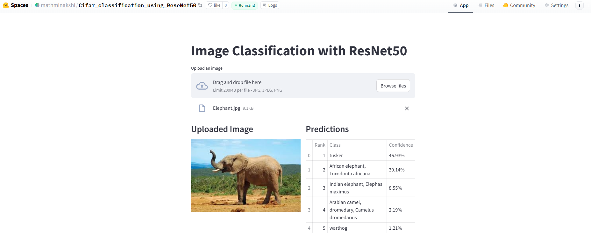

## ImageNet ResNet50 TSAI

This is a PyTorch implementation of training a ResNet50 model from scatch for the ImageNet dataset, as part of The School of AI Session 9 Assignment.

## About ImageNet
ImageNet is a large dataset of images with over 14 million images and 22,000 categories. It is used for training and testing deep learning models, particularly for image classification tasks. ImageNet-1k is a subset of ImageNet with 1000 categories.

Sample image from ImageNet-1k after transformations:

## Training Infrastructure & Process
AWS EC2 instance Training

<div style="display: flex; justify-content: space-between; align-items: center;">   
    
</div>

The model successfully identifies different types of images, as shown in the examples above with an elephant and a husky.

**Setup** :
- Network Volume: 500GB for ImageNet-1K dataset storage
- GPU: NVIDIA T4 Tensor Core GPU
-Number of GPUs: 1
-GPU Memory: 16 GB GDDR6
- Cost: ~$33 for the training run
- Training Time: ~40 minutes per epoch (20 epochs total)

**Training Optimizations:**
- Mixed Precision Training (FP16)
- One Cycle Learning Rate Policy
- Learning Rate found using LR Finder

**Learning Rate Finding: Arriving at 0.17**

This section contains the plots generated during the learning rate finder process.

<div style="display: flex; justify-content: space-between; align-items: center;">   
    
    
</div>

## Training logs
```
/home/ubuntu/raw_data/extracted/ILSVRC/Data/CLS-LOC/train
Number of training samples: 1281166
Number of validation samples: 50000
Using mixed precision training
Loaded checkpoint '/home/ubuntu/checkpoints/best_model.pth' (epoch 3)
Previous best accuracy: 39.76%

Model Summary:
==========================================================================================================================================================================
Layer (type:depth-idx)                        Input Shape               Output Shape              Param #                   Kernel Shape              Mult-Adds
==========================================================================================================================================================================
ResNet50                                      [256, 3, 224, 224]        [256, 1000]               --                        --                        --
├─ResNet: 1-1                                 [256, 3, 224, 224]        [256, 1000]               --                        --                        --
│    └─Conv2d: 2-1                            [256, 3, 224, 224]        [256, 64, 112, 112]       9,408                     [7, 7]                    30,211,571,712
│    └─BatchNorm2d: 2-2                       [256, 64, 112, 112]       [256, 64, 112, 112]       128                       --                        32,768
│    └─ReLU: 2-3                              [256, 64, 112, 112]       [256, 64, 112, 112]       --                        --                        --
│    └─MaxPool2d: 2-4                         [256, 64, 112, 112]       [256, 64, 56, 56]         --                        3                         --
│    └─Sequential: 2-5                        [256, 64, 56, 56]         [256, 256, 56, 56]        --                        --                        --
│    │    └─Bottleneck: 3-1                   [256, 64, 56, 56]         [256, 256, 56, 56]        75,008                    --                        59,190,345,728
│    │    └─Bottleneck: 3-2                   [256, 256, 56, 56]        [256, 256, 56, 56]        70,400                    --                        55,901,880,320
│    │    └─Bottleneck: 3-3                   [256, 256, 56, 56]        [256, 256, 56, 56]        70,400                    --                        55,901,880,320
│    └─Sequential: 2-6                        [256, 256, 56, 56]        [256, 512, 28, 28]        --                        --                        --
│    │    └─Bottleneck: 3-4                   [256, 256, 56, 56]        [256, 512, 28, 28]        379,392                   --                        95,362,351,104
│    │    └─Bottleneck: 3-5                   [256, 512, 28, 28]        [256, 512, 28, 28]        280,064                   --                        55,902,076,928
│    │    └─Bottleneck: 3-6                   [256, 512, 28, 28]        [256, 512, 28, 28]        280,064                   --                        55,902,076,928
│    │    └─Bottleneck: 3-7                   [256, 512, 28, 28]        [256, 512, 28, 28]        280,064                   --                        55,902,076,928
│    └─Sequential: 2-7                        [256, 512, 28, 28]        [256, 1024, 14, 14]       --                        --                        --
│    │    └─Bottleneck: 3-8                   [256, 512, 28, 28]        [256, 1024, 14, 14]       1,512,448                 --                        95,363,006,464
│    │    └─Bottleneck: 3-9                   [256, 1024, 14, 14]       [256, 1024, 14, 14]       1,117,184                 --                        55,902,470,144
│    │    └─Bottleneck: 3-10                  [256, 1024, 14, 14]       [256, 1024, 14, 14]       1,117,184                 --                        55,902,470,144
│    │    └─Bottleneck: 3-11                  [256, 1024, 14, 14]       [256, 1024, 14, 14]       1,117,184                 --                        55,902,470,144
│    │    └─Bottleneck: 3-12                  [256, 1024, 14, 14]       [256, 1024, 14, 14]       1,117,184                 --                        55,902,470,144
│    │    └─Bottleneck: 3-13                  [256, 1024, 14, 14]       [256, 1024, 14, 14]       1,117,184                 --                        55,902,470,144
│    └─Sequential: 2-8                        [256, 1024, 14, 14]       [256, 2048, 7, 7]         --                        --                        --
│    │    └─Bottleneck: 3-14                  [256, 1024, 14, 14]       [256, 2048, 7, 7]         6,039,552                 --                        95,364,317,184
│    │    └─Bottleneck: 3-15                  [256, 2048, 7, 7]         [256, 2048, 7, 7]         4,462,592                 --                        55,903,256,576
│    │    └─Bottleneck: 3-16                  [256, 2048, 7, 7]         [256, 2048, 7, 7]         4,462,592                 --                        55,903,256,576
│    └─AdaptiveAvgPool2d: 2-9                 [256, 2048, 7, 7]         [256, 2048, 1, 1]         --                        --                        --
│    └─Linear: 2-10                           [256, 2048]               [256, 1000]               2,049,000                 --                        524,544,000
==========================================================================================================================================================================
Total params: 25,557,032
Trainable params: 25,557,032
Non-trainable params: 0
Total mult-adds (Units.TERABYTES): 1.05
==========================================================================================================================================================================
Input size (MB): 154.14
Forward/backward pass size (MB): 45524.93
Params size (MB): 102.23
Estimated Total Size (MB): 45781.30
==========================================================================================================================================================================

Training on cuda
Number of classes: 1000
Logging to: outputs/training_log_20250102_050748.txt

Epoch 1/20:
Train Loss: 6.9691 Acc: 14.91%
Val Loss: 6.8967 Top-1: 0.36% Top-5: 1.64%
New best accuracy: Top-1 0.36%
Saved checkpoint to: checkpoints/checkpoint_epoch_001.pth
Saved best model to: checkpoints/model_best.pth

Epoch 2/20:
Train Loss: 6.6982 Acc: 21.77%
Val Loss: 6.4793 Top-1: 0.92% Top-5: 3.62%
New best accuracy: Top-1 0.92%
Saved checkpoint to: checkpoints/checkpoint_epoch_001.pth
Saved best model to: checkpoints/model_best.pth

Epoch 3/20:
Train Loss: 6.6982 Acc: 33.76%
Val Loss: 6.4793 Top-1: 39.91% Top-5: 58.62%
New best accuracy: Top-1 0.92%
Saved checkpoint to: checkpoints/checkpoint_epoch_001.pth
Saved best model to: checkpoints/model_best.pth

Epoch 4/20:
Train Loss: 2.8462 Acc: 38.81%
Val Loss: 2.3987 Top-1: 45.32% Top-5: 71.99%Train Top-1: 38.81%Val Top-1: 45.32%Train Top-5: 0.00%Val Top-5: 71.99%
New best accuracy: Top-1 45.32%
Saved checkpoint to: /home/ubuntu/checkpoints/checkpoint_epoch_004.pth
Saved best model to: /home/ubuntu/checkpoints/model_best.pth

Epoch 5/20:
Train Loss: 2.6471 Acc: 42.34%
Val Loss: 2.3174 Top-1: 47.26% Top-5: 73.02%Train Top-1: 42.34%Val Top-1: 47.26%Train Top-5: 0.00%Val Top-5: 73.02%
New best accuracy: Top-1 47.26%
Saved checkpoint to: /home/ubuntu/checkpoints/checkpoint_epoch_005.pth
Saved best model to: /home/ubuntu/checkpoints/model_best.pth

Epoch 6/20:
Train Loss: 2.5197 Acc: 44.68%
Val Loss: 2.1191 Top-1: 50.38% Top-5: 76.70%Train Top-1: 44.68%Val Top-1: 50.38%Train Top-5: 0.00%Val Top-5: 76.70%
New best accuracy: Top-1 50.38%
Saved checkpoint to: /home/ubuntu/checkpoints/checkpoint_epoch_006.pth
Saved best model to: /home/ubuntu/checkpoints/model_best.pth

Epoch 7/20:
Train Loss: 2.4208 Acc: 46.43%
Val Loss: 2.0648 Top-1: 51.50% Top-5: 77.45%Train Top-1: 46.43%Val Top-1: 51.50%Train Top-5: 0.00%Val Top-5: 77.45%
New best accuracy: Top-1 51.50%
Saved checkpoint to: /home/ubuntu/checkpoints/checkpoint_epoch_007.pth
Saved best model to: /home/ubuntu/checkpoints/model_best.pth

Epoch 8/20:
Train Loss: 2.3503 Acc: 47.74%
Val Loss: 2.0377 Top-1: 52.13% Top-5: 77.82%Train Top-1: 47.74%Val Top-1: 52.13%Train Top-5: 0.00%Val Top-5: 77.82%
New best accuracy: Top-1 52.13%
Saved checkpoint to: /home/ubuntu/checkpoints/checkpoint_epoch_008.pth
Saved best model to: /home/ubuntu/checkpoints/model_best.pth

Epoch 9/20:
Train Loss: 2.2925 Acc: 48.84%
Val Loss: 1.9664 Top-1: 53.73% Top-5: 78.95%Train Top-1: 48.84%Val Top-1: 53.73%Train Top-5: 0.00%Val Top-5: 78.95%
New best accuracy: Top-1 53.73%
Saved checkpoint to: /home/ubuntu/checkpoints/checkpoint_epoch_009.pth
Saved best model to: /home/ubuntu/checkpoints/model_best.pth

Epoch 10/20:
Train Loss: 2.2474 Acc: 49.70%
Val Loss: 1.9257 Top-1: 54.48% Top-5: 79.68%Train Top-1: 49.70%Val Top-1: 54.48%Train Top-5: 0.00%Val Top-5: 79.68%
New best accuracy: Top-1 54.48%
Saved checkpoint to: /home/ubuntu/checkpoints/checkpoint_epoch_010.pth
Saved best model to: /home/ubuntu/checkpoints/model_best.pth

Epoch 11/20:
Train Loss: 2.2090 Acc: 50.38%
Val Loss: 1.8851 Top-1: 55.59% Top-5: 80.17%Train Top-1: 50.38%Val Top-1: 55.59%Train Top-5: 0.00%Val Top-5: 80.17%
New best accuracy: Top-1 55.59%
Saved checkpoint to: /home/ubuntu/checkpoints/checkpoint_epoch_011.pth
Saved best model to: /home/ubuntu/checkpoints/model_best.pth

Epoch 12/20:
Train Loss: 2.1780 Acc: 50.98%
Val Loss: 1.8542 Top-1: 56.26% Top-5: 80.69%Train Top-1: 50.98%Val Top-1: 56.26%Train Top-5: 0.00%Val Top-5: 80.69%
New best accuracy: Top-1 56.26%
Saved checkpoint to: /home/ubuntu/checkpoints/checkpoint_epoch_012.pth
Saved best model to: /home/ubuntu/checkpoints/model_best.pth

Epoch 13/20:
Train Loss: 2.1532 Acc: 51.48%
Val Loss: 1.8851 Top-1: 55.45% Top-5: 80.19%Train Top-1: 51.48%Val Top-1: 55.45%Train Top-5: 0.00%Val Top-5: 80.19%
Saved checkpoint to: /home/ubuntu/checkpoints/checkpoint_epoch_013.pth

Epoch 14/20:
Train Loss: 2.1238 Acc: 52.03%
Val Loss: 1.8530 Top-1: 56.29% Top-5: 80.79%Train Top-1: 52.03%Val Top-1: 56.29%Train Top-5: 0.00%Val Top-5: 80.79%
New best accuracy: Top-1 56.29%
Saved checkpoint to: /home/ubuntu/checkpoints/checkpoint_epoch_014.pth
Saved best model to: /home/ubuntu/checkpoints/model_best.pth

``` 
## Model Architecture
ResNet50 consists of 48 Convolutional layers, 1 MaxPool layer, and 1 Average Pool layer, followed by a fully connected layer. The model uses skip connections to solve the vanishing gradient problem.

Key components:

Input: 224x224x3 images
Output: 1000 classes (ImageNet-1K)
Total Parameters: 25.6M

** Training Configuration **
```
batch_size: 256
name: resnet_50_onecycle
start_lr: 0.0000001
end_lr: 100
num_classes: 1000
num_iter: 100
output_dir: lr_finder_plots
workers: 8
max_lr: 0.0675
momentum: 0.9
weight_decay: 0.0001
epochs: 4
pct_start: 0.3
div_factor: 25.0
final_div_factor: 0.0001
optimizer: SGD
max_lr: 0.675
epochs: 10
steps_per_epoch: <steps_per_epoch_value>  # Replace with actual value
base_momentum: 0.85
max_momentum: 0.95
cycle_momentum: true
total_steps: <total_steps_value>  # Replace with actual value
pct_start: 0.3
div_factor: 25.0
final_div_factor: 0.0001
three_phase: true
initial_model_path : ./initial_model_state.pth
data_dir: /home/ubuntu/raw_data/extracted/ILSVRC
resume: true
checkpoint_dir: /home/ubuntu/checkpoints
```

## Model Deployment
The trained model is deployed on Hugging Face Spaces and can be accessed at: https://huggingface.co/spaces/mathminakshi/Cifar_classification_using_ReseNet50
Sample predictions from the deployed model:

<div style="display: flex; justify-content: space-between; align-items: center;">   
    
    
</div>

The model successfully identifies different types of images, as shown in the examples above with an elephant and a husky.
