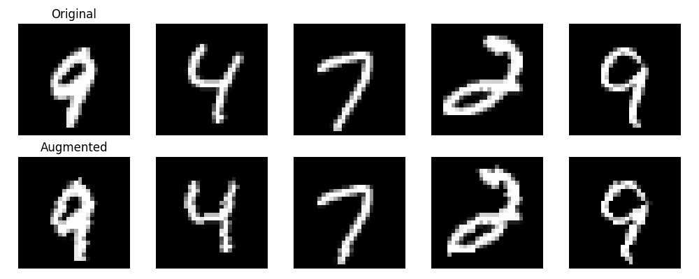
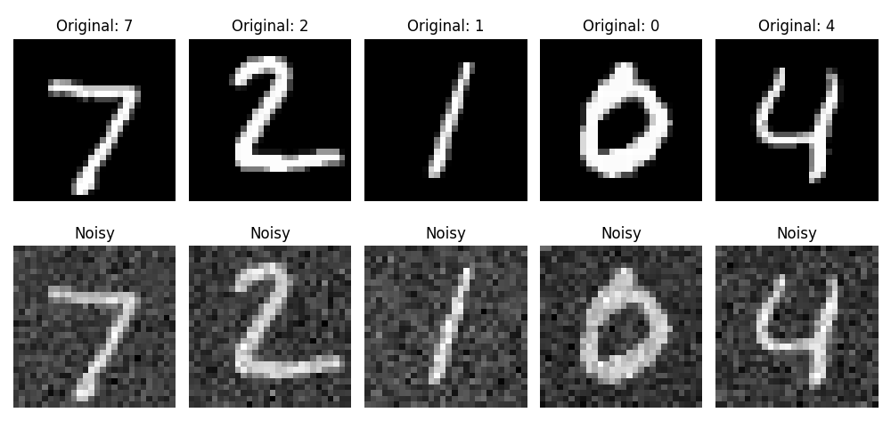
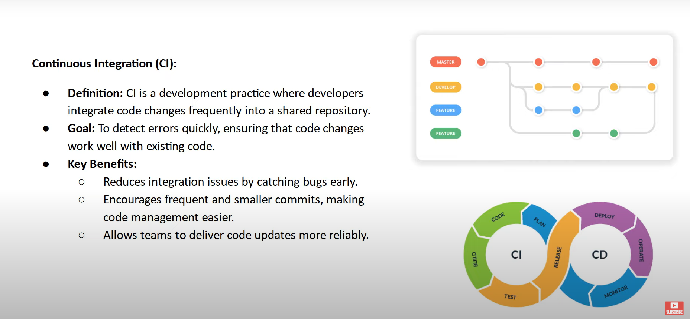
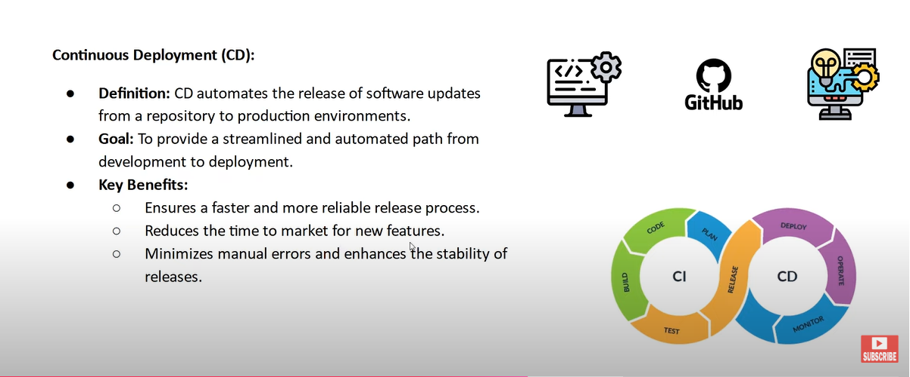

# MNIST MLOps Project

[](https://github.com/minakshimathpal/FULL_STACK_AI/actions/workflows/ml-pipeline.yml)

This project implements a lightweight CNN model for MNIST digit classification with MLOps practices. The model is designed to achieve >95% accuracy in one epoch while keeping parameters under 25,000.
## Data Augmentation
We apply several augmentation techniques to improve model robustness:

1. Random Center Crop (p=0.1)
   - Randomly crops image to 22x22 and resizes back to 28x28
   - Helps model learn scale invariance

2. Random Rotation
   - Rotates image between -15 and 15 degrees
   - Improves rotation invariance

Here are some examples of our augmentations:


- Top row: Original images
- Bottom row: Augmented versions

## CI/CD Pipeline
The GitHub Actions workflow (`ml-pipeline.yml`) automatically:
1. Sets up Python environment
2. Installs dependencies
3. Trains the model
4. Runs tests to verify:
   - Model has <25K parameters
   - Achieves >95% accuracy
5. Uploads trained model as artifact

## Model Architecture
- Input: 28x28 MNIST images
- 7 Convolutional layers
- Batch Normalization
- kernels used #X# and 1X1
- MaxPooling
- Fully connected layer
- Output: 10 classes

## Testing
Tests verify:
1. Model parameter count (<25K)
2. Input/output shapes
3. Model accuracy (>95%)
4. Comparision of predicted label with actual label

## Detailed Testing Strategy

Our testing framework uses pytest with fixtures for efficient and reproducible testing. Here's a breakdown of our test suite:

### Test Configuration (conftest.py)
We use three main fixtures:
1. `models_dir`: Provides the directory path for saved models
2. `mnist_test_data`: Loads MNIST test dataset with proper transformations
3. `get_latest_model`: Loads the most recently trained model for testing

### Test Cases (test_model.py)

#### 1. Model Architecture Test
```python
def test_model_parameters():
    model = SimpleCNN()
    num_params = count_parameters(model)
    assert num_params < 25000, f"Model has {num_params} parameters, should be less than 25000"
```
- Verifies the model has less than 25,000 parameters
- Ensures model maintains lightweight architecture requirement

#### 2. Input/Output Shape Test
```python
def test_input_output_shape():
    model = SimpleCNN()
    test_input = torch.randn(1, 1, 28, 28)
    output = model(test_input)
    assert output.shape == (1, 10), f"Output shape is {output.shape}, should be (1, 10)"
```
- Validates model accepts 28x28 MNIST images
- Confirms output shape matches 10 class predictions

#### 3. Single Image Prediction Test
```python
def test_single_image_prediction(get_latest_model, mnist_test_data):
    images, labels = next(iter(mnist_test_data))  # Get the first batch
    image = images[0].unsqueeze(0)  # Get the first image and add batch dimension
    label = labels[0].item()
    cnn_model = get_latest_model
    output = cnn_model(image)
    _, predicted_label = torch.max(output, 1)
    
    assert predicted_label.item() == label, f"Single image prediction failed. True: {label}, Predicted: {predicted_label.item()}"
```
- Tests model's ability to predict individual images
- Verifies prediction matches ground truth

#### 4. Model Accuracy Test
```python
@pytest.mark.parametrize("accuracy_threshold", [95])
def test_model_accuracy(mnist_test_data,get_latest_model, accuracy_threshold):
    device = torch.device("cuda" if torch.cuda.is_available() else "cpu")
    model = get_latest_model
    # get test data      
    test_loader = mnist_test_data   
    correct = 0
    total = 0
    
    with torch.no_grad():
        for data, target in test_loader:
            data, target = data.to(device), target.to(device)
            outputs = model(data)
            _, predicted = torch.max(outputs.data, 1)
            total += target.size(0)
            correct += (predicted == target).sum().item()
    
    accuracy = 100 * correct / total
    assert accuracy > accuracy_threshold, f"Model accuracy is {accuracy}%, should be > {accuracy_threshold}%" 
```
- Evaluates model on full test dataset
- Ensures >95% accuracy requirement is met
- Uses parameterization for flexible threshold testing

#### 5. Model Accuracy On Noisy Images
```python
@pytest.mark.parametrize("accuracy_threshold", [90])
def test_robustness_against_noise(get_latest_model, mnist_test_data, artifacts_dir, accuracy_threshold):
    """
    Test model's robustness against noisy inputs and save noisy image visualization.
    """
    model = get_latest_model
    device = torch.device("cuda" if torch.cuda.is_available() else "cpu")
    model.to(device)
    model.eval()
    
    # Add Gaussian noise to a sample batch
    data_iter = iter(mnist_test_data)
    images, labels = next(data_iter)
    images = images.to(device)
    labels = labels.to(device)

    noise = torch.randn_like(images) * 0.3  # Adding small noise
    noisy_images = images + noise
    
    with torch.no_grad():
        outputs = model(noisy_images)
        _, predictions = torch.max(outputs, 1)
        correct = (predictions == labels).sum().item()
    
    accuracy = 100 * correct / labels.size(0)
    assert accuracy > accuracy_threshold, f"Model robustness to noise is inadequate. Accuracy: {accuracy}%, should be > {accuracy_threshold}%"

    # Save noisy image visualization
    os.makedirs(artifacts_dir, exist_ok=True)  # Ensure artifacts folder exists
    filepath = os.path.join(artifacts_dir, "noisy_images_visualization.png")
    plt.figure(figsize=(10, 5))
    num_images = 5
    for i in range(num_images):
        # Original image
        plt.subplot(2, num_images, i + 1)
        plt.imshow(images[i].squeeze().cpu().numpy(), cmap="gray")
        plt.title(f"Original: {labels[i].item()}")
        plt.axis("off")
        
        # Noisy image
        plt.subplot(2, num_images, num_images + i + 1)
        plt.imshow(noisy_images[i].squeeze().cpu().numpy(), cmap="gray")
        plt.title("Noisy")
        plt.axis("off")

    plt.tight_layout()
    plt.savefig(filepath)
    plt.close()  # Close the plot to free memory
    print(f"Noisy images visualization saved at: {filepath}")
```
- Evaluates model on full test dataset with added noise component
- Ensures >90% accuracy requirement is met
- Uses parameterization for flexible threshold testing

Here are some examples of Noisy Images:


### Test Execution
Tests are automatically run in our CI/CD pipeline:
1. Model training
2. Test suite execution
3. Results verification
4. Model artifact upload

This comprehensive testing strategy ensures:
- Model meets size constraints
- Correct input/output handling
- Single prediction capability
- Overall accuracy requirements

# Summary of CI/CD in Machine Learning (ML)


## 1. CI/CD Pipeline in ML
- Continuous Integration (CI) and Continuous Deployment (CD) principles, often used in DevOps, can be adapted to streamline ML model development and deployment in production.


## 2. Continuous Integration (CI)
- **Definition**: A practice where developers frequently integrate code changes into a shared repository, automating the processes of building code, resolving dependencies, and running tests.
- **Benefits**:
  - Catches bugs early, reducing integration issues.
  - Encourages smaller, more frequent code commits, simplifying code management.
  - Improves reliability in delivering code updates.



## 3. Continuous Deployment (CD)
- **Definition**: Automates the release of software updates to production environments, eliminating manual deployment steps.
- **Benefits**:
  - Speeds up and stabilizes the release process.
  - Reduces time to market for new features.
  - Minimizes manual errors, improving release stability.

## 4. Typical Project Workflow
- Developers work on branches like development, staging, and main/master.
- Pull requests are used to merge tested and approved code into the main branch, ensuring production readiness.

## 5. CI/CD Workflow Stages
- **Code Commit**: Developers push changes to a shared repository (e.g., GitHub, GitLab).
- **Build Process**: Automated builds compile code, check for errors, and run unit tests to maintain quality.
- **Testing**: Automated tests detect integration issues; failures are flagged for developers.
- **Deployment**: Approved builds are deployed to staging or production environments.
- **Monitoring**: Systems monitor deployed changes for performance and issues.
- **Rollback Mechanism**: Provides a way to revert to previous versions if deployment issues arise.

## 6. Common CI/CD Tools
- **GitHub Actions**: Integrated solution for GitHub repositories.
- **Jenkins**: Popular open-source CI/CD tool.
- **Bitbucket Pipelines**: Tool for Bitbucket repositories.
- **AWS CodePipeline**: CI/CD service from AWS.
- **Azure DevOps**: Microsoft’s CI/CD platform.
- **GitLab CI/CD**: CI/CD tool integrated with GitLab.

## 7. MLOps and CI/CD
- **Definition**: MLOps integrates ML workflows with DevOps practices, automating the lifecycle of ML models, including building, testing, deploying, monitoring, and managing performance.
- **Key Aspects of MLOps**:
  - Model training, testing, packaging, deployment, performance monitoring, and handling issues like model drift.
- These practices are increasingly vital for data scientists and ML engineers to enhance their skillsets and career opportunities.

# Model Monitoring in CI/CD for Machine Learning (ML)

## 1. Importance of Monitoring in MLOps
- Monitoring is a critical component of the CI/CD pipeline in Machine Learning Operations (MLOps).  
- It is particularly essential for addressing **model drift**, a phenomenon where a model's performance degrades over time due to changes in the production data.

## 2. Understanding Model Drift
- **Definition**: Model drift occurs when the data used to train the model no longer reflects the current data encountered in production.  
- **Causes**:
  - Changes in user behavior.
  - Modifications in data collection methods.
  - Shifts in the underlying phenomenon being modeled.  
- **Impact**: Leads to reduced model accuracy and reliability.

## 3. Role of Monitoring
- **Purpose**: Continuously track the model's performance in production to detect issues like model drift.  
- **Metrics to Monitor**:
  - Accuracy, precision, recall, or other task-specific custom metrics.  
- **Response to Performance Drop**:
  - A significant decline in performance may signal the need for model retraining with updated data.

## 4. Addressing Model Drift
- **Detection**: Use monitoring tools and techniques to identify model drift.  
- **Retraining**: Automate the retraining process as part of the CI/CD pipeline, ensuring the model stays updated and performs optimally.

## 5. Common Monitoring Practices
- **Performance Monitoring Dashboards**:
  - Dashboards visualize key performance metrics over time.
  - Help identify trends and anomalies indicating performance degradation.
- **Automated Alerts**:
  - Alerts trigger when performance metrics fall below set thresholds or deviate significantly from expected behavior.
  - Notifications enable quick investigation and corrective action.
- **Data Drift Detection**:
  - Employ statistical techniques to monitor changes in the input feature distributions.
  - Significant deviations suggest the model might not be receiving data similar to its training data.
- **Concept Drift Detection**:
  - Analyze the relationship between input features and target variables.
  - Identify patterns in predictions that deviate from training data expectations.

## 6. Tools and Techniques
- Specific tools and methods for monitoring vary based on:
  - The ML use case.
  - Model complexity.
  - Deployment infrastructure.
- Examples include setting up custom dashboards, configuring alerts, and applying drift detection techniques.

Monitoring ensures that ML models remain accurate, reliable, and effective in dynamic production environments.

## License
MIT

## Author
[Minakshi Mathpal]

