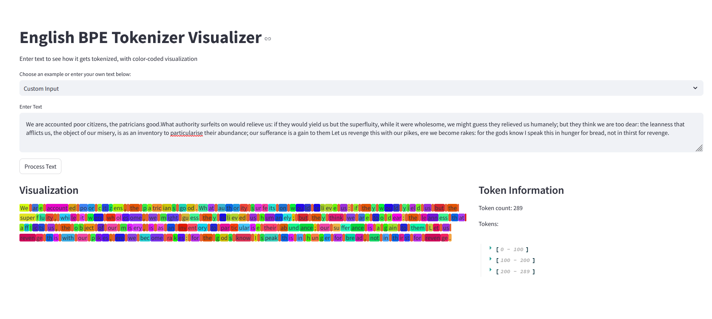
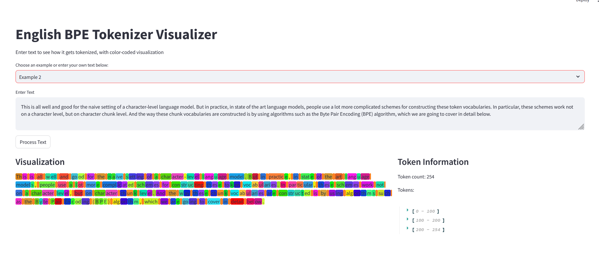

# BPE Tokenizer Visualizer

A interactive web application that demonstrates how Byte Pair Encoding (BPE) tokenization works on English text. This tool provides a visual representation of how text gets broken down into tokens, making it easier to understand the tokenization process.

## 🌟 Features

- **Interactive Text Input**: Enter any English text or choose from provided examples
- **Color-Coded Visualization**: Each unique token is assigned a distinct color for easy identification
- **Token Information**: View detailed information about the tokenization process
- **Real-time Processing**: Instantly see how your text gets tokenized
- **Hover Information**: Mouse over tokens to see their token IDs

## 🚀 Live Demo

Try out the live demo [here](https://huggingface.co/spaces/mathminakshi/BPETokenizer)

## 💻 Technical Details

The tokenizer uses Byte Pair Encoding (BPE), a data compression technique that iteratively replaces the most frequent pair of bytes in a sequence with a single, unused byte. In the context of text tokenization:

- Starts with a base vocabulary of individual characters
- Iteratively merges the most frequent pairs of tokens
- Creates a vocabulary of subword units
- Efficiently handles unknown words and rare tokens

## 🛠️ Implementation

The implementation includes:
- Custom BPE tokenizer implementation
- Pre-trained model on English text
- Streamlit-based web interface
- Efficient token visualization system

## 📊 Usage Examples

### Example Texts

Here are the example texts included in the application:

#### Example 1:
```
[Content of testdata1.txt]
```

#### Example 2:
```
[Content of testdata2.txt]
```

### How to Use:

1. **Basic Usage**:
   - Select "Example 1" or "Example 2" to see pre-loaded examples
   - Or enter your own text in the "Custom Input" option
   - Click "Process Text" to see the tokenization

2. **Understanding Output**:
   - Each color represents a unique token
   - Hover over tokens to see their IDs
   - Check the token count and sequence in the information panel






## 🔧 Local Development

To run this project locally:

1. Clone the repository
2. Install dependencies:
   ```bash
   pip install -r requirements.txt
   ```
3. Run the Streamlit app:
   ```bash
   streamlit run app.py
   ```

## 📚 References

- [BPE Original Paper](https://www.aclweb.org/anthology/P16-1162/)
- [Subword Tokenization](https://huggingface.co/docs/transformers/tokenizer_summary#subword-tokenization)

## 🤝 Contributing

Contributions are welcome! Feel free to submit issues and pull requests.

## 📄 License

This project is licensed under the MIT License - see the LICENSE file for details. 